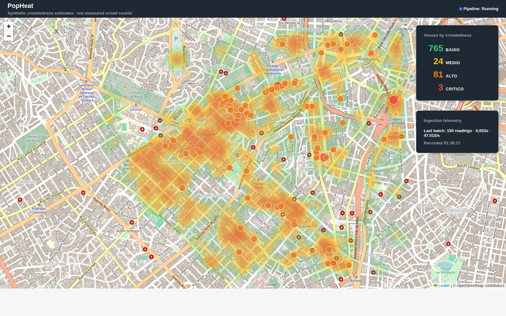

# PopHeat

**A live crowdedness heat map for bars, restaurants, cafés, and nightlife venues — built as a native InterSystems IRIS Interoperability Production using embedded Python (PyProd).**

Submitted to the [InterSystems Portuguese Developer Community Programming Contest 2026](https://pt.community.intersystems.com/post/concurso-de-programa%C3%A7%C3%A3o-da-comunidade-de-desenvolvedores-da-intersystems-pt-2026) — **PyProd track**.



---

## What it is

PopHeat ingests a catalog of nightlife/food venues sourced from OpenStreetMap, continuously computes a synthetic crowdedness score for each one, classifies every reading into a business-facing label (`BAIXO` / `MEDIO` / `ALTO` / `CRITICO`), persists it, and serves it on a live-updating Leaflet heat map — end to end, on InterSystems IRIS.

There is no free, ToS-compliant "how busy is this place right now" data source, so PopHeat does **not** claim to measure real foot traffic. Popularity is an openly documented, deterministic **model** — a time-of-day/day-of-week curve per venue category, with a small controlled random jitter — recomputed from scratch on every ingestion tick. This is stated on the dashboard itself ("Synthetic crowdedness estimates · not measured crowd counts") and in [`specs/popularity-model.spec`](specs/popularity-model.spec).

## Why PyProd

The whole pipeline — polling, scoring, classification, persistence — is one **IRIS Interoperability Production** (`PopHeat.Production`) built entirely with the [`iop`](https://pypi.org/project/iris-pex-embedded-python/) embedded-Python framework: no ObjectScript business logic, no external orchestration service. Three Python business hosts, wired declaratively in [`settings.py`](settings.py):

```
CatalogPollingService  →  ScoreClassifyProcess  →  PersistOperation
   (Business Service)        (Business Process)      (Business Operation)
```

- **`CatalogPollingService`** — a `PollingBusinessService` that walks the static venue catalog in fixed 150-venue batches on a 3-second cadence, wrapping back to the start once it reaches the end (so every venue is revisited on a regular cycle, not just once).
- **`ScoreClassifyProcess`** — a `BusinessProcess` that computes each venue's popularity score and heat-level label for the batch, re-reading the classification thresholds from config on every call (so an analyst can retune BAIXO/MEDIO/ALTO/CRITICO cutoffs without a redeploy).
- **`PersistOperation`** — a `BusinessOperation` that inserts every reading in the batch plus one batch-telemetry row (readings/sec throughput) via IRIS's embedded-Python persistence API.

A batch travels through all three stages as one atomic unit; a failure in one batch is isolated and logged without stopping the next scheduled tick.

## Live demo

| | |
|---|---|
| Dashboard | `http://<host>:52773/csp/popheat/dashboard.html` |
| REST API | `http://<host>:52773/csp/popheat/api/*` |
| Coverage area | Central São Paulo (Consolação / Jardim Paulista / Bela Vista) — one bounding box, config-driven |

The dashboard renders a Leaflet/OpenStreetMap heat layer weighted by live popularity, with discrete markers (sized by severity) reserved for `ALTO`/`CRITICO` venues only, a running counts panel, and an ingestion-telemetry panel — all re-fetched every 10 seconds with no page reload. Everything is public and unauthenticated: it's a read-only demo with no PII.

## REST API

Unauthenticated, read-only, parameterless SQL only (`iris/PopHeat/API.cls`):

| Route | Returns |
|---|---|
| `GET /csp/popheat/api/venues` | Latest reading per venue (id, name, category, lat/lon, popularity, heat level, timestamp) |
| `GET /csp/popheat/api/counts` | Venue count per heat level (`BAIXO`/`MEDIO`/`ALTO`/`CRITICO`), always in sync with `/venues` |
| `GET /csp/popheat/api/telemetry` | Most recent 20 ingestion batches (reading count, elapsed time, throughput) |
| `GET /csp/popheat/api/status` | Whether `PopHeat.Production` is currently running |

## Architecture

```
                         ┌──────────────────────────────────────────┐
 scripts/build_catalog.py│  IRIS Interoperability Production         │
  (OpenStreetMap/         │  PopHeat.Production  (embedded Python)    │
   Overpass API,          │                                            │
   run on demand)   ─────▶│  CatalogPollingService                    │
                         │        │  (150 venues / 3s, circular)       │
  data/venues.json ─────▶│        ▼                                   │
   (static catalog)      │  ScoreClassifyProcess                      │
                         │        │  popularity + BAIXO/MEDIO/ALTO/    │
                         │        │  CRITICO classification            │
                         │        ▼                                   │
                         │  PersistOperation                          │
                         │        │  insert-only, batch-atomic         │
                         └────────┼──────────────────────────────────┘
                                  ▼
                    PopHeat.Reading / PopHeat.BatchTelemetry
                          (IRIS %Persistent classes)
                                  │
                                  ▼
                    PopHeat.API  (unauthenticated REST, %CSP.REST)
                                  │
                                  ▼
                 dashboard.html  (static Leaflet/OSM page, polls every 10s)
```

The venue *catalog* (identity, name, category, coordinates) is a manually-refreshed static snapshot — only *crowdedness* is recomputed continuously. This split keeps ingestion cheap and makes "changing city" a one-file config change, not a code change.

## Popularity model & heat classification

- Every venue category (`cafe`, `restaurant`, `fast_food`, `bar`, `pub`, `nightclub`, or a generic fallback) follows its own daily curve with category-specific peak hours (e.g. a `bar` peaks around 22h and 1h; a `cafe` around 9h and 15h). Time distance to a peak wraps at midnight — the day is circular.
- Friday–Sunday gets a 20% weekend boost before the score is clamped to `[0.02, 0.98]`.
- A small random jitter (±0.06) keeps repeated readings of the same venue at the same hour from being identical.
- Nightlife venues (`bar`/`pub`/`nightclub`) are classified on a **lower** popularity scale than daytime venues, so a normal busy night at a bar doesn't read as `CRITICO` the way it would for a café — thresholds are external config (`config/heat_thresholds.json`), not code.

Full business rules: [`specs/popularity-model.spec`](specs/popularity-model.spec) and [`specs/heat-classification.spec`](specs/heat-classification.spec).

## Tech stack

- **InterSystems IRIS Community Edition** (Docker) — Interoperability enabled, embedded Python
- **[`iop`](https://pypi.org/project/iris-pex-embedded-python/)** (`iris-pex-embedded-python`) — pure-Python IRIS Interoperability Production framework (PyProd)
- **Python** — pipeline components, scoring/classification logic, catalog builder, unit tests (stdlib `unittest`, zero third-party runtime deps for the pipeline itself)
- **OpenStreetMap Overpass API** — venue catalog source
- **Leaflet.js + Leaflet.heat** — dashboard map rendering, loaded from CDN with pinned Subresource Integrity hashes
- Zero server-side ObjectScript UI code — the dashboard is one static HTML/JS file served directly by IRIS's web engine

## Project layout

```
docker-compose.yml          Single-service IRIS Community stack
docker/init-production.sh   One-time (safe-to-re-run) namespace/production bootstrap
iris/merge.cpf               Auto-creates the POPHEAT namespace/database on first boot
iris/PopHeat/
  Reading.cls                 %Persistent — one insert-only row per reading
  BatchTelemetry.cls          %Persistent — one row per ingested batch
  API.cls                     Unauthenticated REST layer (%CSP.REST)
  www/dashboard.html          Static Leaflet dashboard
settings.py                  iop --migrate entrypoint: wires the production graph
popheat_pipeline/
  components.py                CatalogPollingService / ScoreClassifyProcess / PersistOperation
  scoring.py                   Pure, IRIS-independent popularity/classification/batching math
scripts/build_catalog.py     OpenStreetMap Overpass → data/venues.json (run on demand)
config/
  catalog_build.json           Bounding box, amenity allowlist, Overpass endpoint
  heat_thresholds.json         BAIXO/MEDIO/ALTO/CRITICO cutoffs (nightlife vs. daytime)
specs/                        Business-rule specs (source of truth for requirements)
tests/                        56 unit tests for scoring.py and build_catalog.py (unittest, no IRIS needed)
```

## Running it

Requires Docker.

```bash
git clone https://github.com/jean-cruz/popheat.git
cd popheat

# 1. Build the venue catalog (OpenStreetMap Overpass API)
python3 scripts/build_catalog.py

# 2. Start IRIS
docker compose up -d

# 3. One-time bootstrap: namespace, IOP classes, production start
docker compose exec iris sh /irisdev/app/docker/init-production.sh
```

Then open `http://localhost:52773/csp/popheat/dashboard.html`. Readings start appearing within a few seconds of the first poll cycle.

> **Note on `docker compose down`:** the POPHEAT database lives inside the container's own writable filesystem (by design, for demo durability across `restart`/host reboot), not a named volume. Use `docker compose restart` to cycle the running demo; `down` permanently deletes all ingested readings and requires re-running `init-production.sh`.

Run the pipeline's unit tests (pure Python, no IRIS required):

```bash
python3 -m unittest discover -s tests
```

## Out of scope (v1)

- Real live "how busy" data — deliberately synthetic only, see the model rationale above
- Multi-city support — single bounding box per deployment, config-only to change
- Authentication — public, read-only demo by design
- Historical trend charts — telemetry is scoped to the most recent 20 batches, not a full log

## License

MIT.
