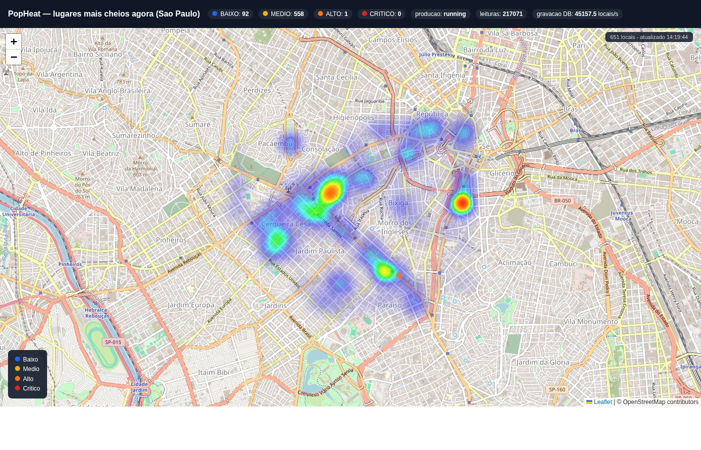

# PopHeat: um mapa de calor de lugares cheios, construído com PyProd e desenvolvimento assistido por IA

*Artigo para o Concurso de Programação da Comunidade PT da InterSystems 2026 — trilha PyProd.*
*Tags: #Concurso #ConcursoProgramacaoIA #AIProgramContest*

## A ideia

A ideia original era simples: usar os dados de "horários de pico" do Google Maps para desenhar um mapa de calor dos lugares mais cheios de São Paulo. Antes de escrever a primeira linha de código, fui checar se isso era viável — e não era, pelo menos não da forma que eu imaginava. Documento essa investigação aqui porque ela mudou completamente o desenho da solução, e acho que é o tipo de decisão que vale mais a pena mostrar do que esconder.

## Por que os dados não são "reais" (e por que isso é honesto, não uma limitação escondida)

O Google não expõe os dados de "Popular Times" via API pública. A única forma de obtê-los é através de bibliotecas não-oficiais que fazem scraping de endpoints internos do Google Maps — frágil, e contra os Termos de Serviço do Google. Não é uma base aceitável para uma submissão de concurso.

A alternativa óbvia parecia ser a **Foursquare Places API**, que tem um campo oficial `popularity`. Só que, ao checar o modelo de preços atual, descobri que a Foursquare mudou a política em junho de 2026: o tier gratuito caiu para 500 chamadas Pro/mês, e o campo `popularity` está nos endpoints **Premium**, cobrados desde a primeira chamada — sem tier gratuito nenhum para esse dado específico.

Dado isso, a decisão foi usar:

- **Locais reais** (nome, categoria, coordenadas) do **OpenStreetMap**, via Overpass API — gratuita, sem chave, sem surpresas de limite de uso. Consegui ~650 locais reais na região da Avenida Paulista/Jardins/Pinheiros, em São Paulo (bares, restaurantes, cafés, pubs, discotecas).
- Um **modelo sintético de popularidade**, transparente e documentado no próprio código: uma soma de curvas gaussianas por categoria e horário (cafés têm pico de manhã, bares e discotecas de madrugada), com reforço no fim de semana e ruído aleatório pequeno. Não é dado real de movimento de pessoas, e o código deixa isso explícito nos comentários e no README.

Prefiro um projeto honesto sobre o que é real e o que é simulado do que fingir uma fonte de dados que não existe de graça e legalmente.

## Arquitetura: PyProd de ponta a ponta

O PyProd é uma biblioteca que permite escrever produções de interoperabilidade do IRIS inteiramente em Python puro — sem precisar tocar em ObjectScript para os componentes de negócio. A produção do PopHeat tem quatro peças:

1. **`OverpassInAdapter`** (Inbound Adapter) — a cada 3 segundos, pega um lote de ~150 locais da lista carregada de `data/venues.json`, calcula a popularidade sintética de cada um pro instante atual, e entrega o lote pro Service.
2. **`VenueIngestService`** (Business Service) — empacota o lote inteiro numa mensagem persistível (`VenueBatch`) e manda pro Process.
3. **`HeatClassifierProcess`** (Business Process) — para cada local do lote, chama uma **Business Rule real do IRIS** (`PopHeat.Rule.HeatLevel`, não um `if/elif` escondido em Python) que classifica o nível de lotação (BAIXO/MEDIO/ALTO/CRITICO). A regra tem limiares diferentes para locais de vida noturna (bares, pubs, discotecas) e locais diurnos — algo que um analista de negócio poderia reajustar direto no Rule Editor do IRIS, sem tocar em código.
4. **`HeatPersistOperation`** (Business Operation) — grava cada leitura classificada na tabela SQL `PopHeat.VenueReading` e registra uma métrica de telemetria (`PopHeat.BatchMetric`: tamanho do lote, tempo gasto, taxa de gravação).

Por cima disso, um **dashboard Flask hospedado como aplicação WSGI diretamente pelo IRIS** (`Security.Applications` com `DispatchClass=%SYS.Python.WSGI`) lê a tabela via SQL embutido (`iris.sql.exec`, sem round-trip de rede) e desenha o mapa de calor com Leaflet, atualizando a cada 10 segundos.



## Como usei IA no desenvolvimento

Todo o projeto foi construído com o **Claude Code** operando diretamente no meu terminal, com acesso real a Docker, ao container IRIS e à internet — não foi "peça o código pronto e cole", foi um ciclo iterativo de implementar, rodar, ver o erro real, e corrigir. Achei importante documentar os problemas reais encontrados, porque foram eles que mais consumiram tempo — e onde a IA foi mais útil não foi gerando código bonito de primeira, mas depurando problemas de ambiente que eu não teria diagnosticado rápido sozinho:

- A imagem Docker `intersystemsdc/iris-community:latest` tem um hook interno (`iris-after-start`) que falha com um erro de `dbapi.connect` e derruba o container. Troquei para a imagem oficial `intersystems/iris-community`.
- A tag `2025.1` dessa mesma imagem tem a licença Community **expirada** em relação à data atual (setembro de 2026) — subi pra `2026.2`.
- O flag oficial de definir senha no boot (`-p arquivo-de-senha`) está quebrado nessa versão (`SYS.Container.ChangeGatewayMgrPassword` falha). A solução foi trocar a senha via ObjectScript logo após o boot.
- O banco `ENSLIB` vem montado **somente-leitura** por padrão — e é exatamente onde o PyProd tenta compilar as classes geradas. Sem destravar isso, toda tentativa de carregar a produção falhava com erro de permissão, sem nenhuma mensagem óbvia apontando pra causa raiz.
- As condições das Business Rules do IRIS usam operadores `&&`/`||` (estilo C), não `&`/`!` (estilo MUMPS clássico) — usar `&` sozinho não dá erro, só classifica errado silenciosamente. Só percebi porque testei a regra isoladamente com valores conhecidos antes de integrá-la ao pipeline.
- A primeira versão do pipeline mandava uma mensagem PyProd por local. Com ~1.500 locais isso significava milhares de saltos síncronos entre Service/Process/Operation por ciclo — um ciclo completo levava mais de uma hora. Reprojetei para um lote inteiro viajar como uma única mensagem, e persistir cada linha diretamente via `iris.cls(...)._New()/._Save()` dentro da Operation, sem mais um salto de mensageria por linha. Isso derrubou o tempo de ciclo completo para menos de um minuto.
- Ao registrar a aplicação WSGI do dashboard, o IRIS passou a tratá-la como a "aplicação padrão" do namespace `POPHEAT` no Management Portal (porque nenhuma outra aplicação declarava esse namespace), quebrando os links internos do menu de Interoperabilidade. A correção foi criar explicitamente uma aplicação `/csp/popheat` própria para o Portal, no mesmo molde da aplicação padrão `/csp/user`.

Nenhum desses problemas é "um bug de IA" — são detalhes reais de operar IRIS em container que qualquer pessoa bateria de frente. O valor de trabalhar com um agente de IA aqui foi a velocidade de iterar: testar uma hipótese, ler o erro real do IRIS, ajustar, repetir — em vez de eu sozinho vasculhando documentação e fóruns por horas a cada obstáculo.

## Rodando o projeto

```bash
git clone https://github.com/jean-cruz/popheat.git
cd popheat
docker compose up -d
bash iris/setup.sh
```

O script `setup.sh` é idempotente e faz tudo sozinho: senha, `%Service_CallIn`, namespace `POPHEAT`, ENSLIB read/write, aplicações web (dashboard + Portal), compilação da Business Rule, instalação de `intersystems_pyprod`/`flask` no Python embutido, geração e carga da produção PyProd, e início da produção.

Dashboard: **http://localhost:52773/popheat/**

## Pontuação (trilha PyProd)

| Item | Pontos | Status |
|---|---|---|
| Projeto base PyProd | 5 | ✅ |
| 3 hosts (Service + Process + Operation) | +1 | ✅ |
| Adapter | +1 | ✅ |
| Business Rules | +2 | ✅ |
| Aplicação WSGI | +3 | ✅ |
| Monitoramento/telemetria | +2 | ✅ |
| IntegratedML | +3 | não tentado |

## Limitações e próximos passos

- A popularidade é sintética, não é dado real de movimento de pessoas — documentado deliberadamente, não escondido.
- IntegratedML ficou de fora desta rodada por tempo; o próximo passo natural seria treinar um modelo `PREDICT` sobre o histórico acumulado em `PopHeat.VenueReading` para prever a tendência de lotação da próxima hora por local/categoria.
- A arquitetura é facilmente portável para outra cidade: basta trocar a bounding box em `data/fetch_venues.py` e regenerar o dataset.

## Links

- Repositório: https://github.com/jean-cruz/popheat
- Open Exchange: *(adicionar link após publicar)*
